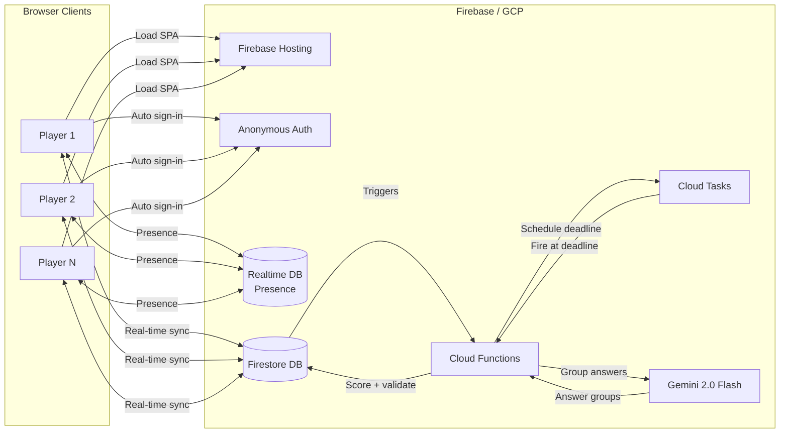
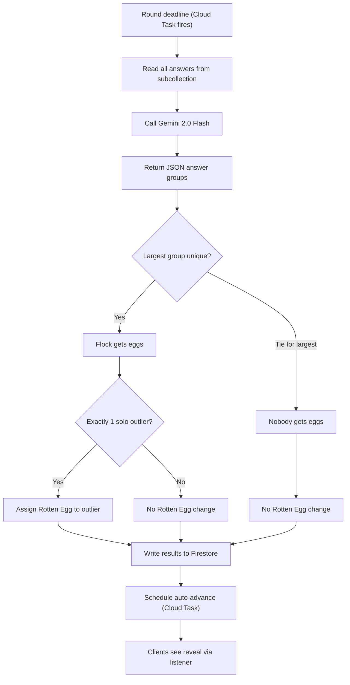

# Flock Together - Build Plan

## Build Checklist

- [ ] **Firebase Setup** -- Initialize Firebase project (Firestore, Auth, RTDB, Functions, Hosting, Cloud Tasks), install frontend dependencies (React, Vite, Tailwind, Firebase SDK), set up project structure
- [ ] **Auth & Presence** -- Set up Firebase Anonymous Auth (auto sign-in, UID persistence), RTDB presence system (connected/disconnected tracking), host auto-transfer on disconnect
- [ ] **Data Model** -- Define Firestore data model with answer subcollection, rooms collection for code uniqueness, write security rules (answer peeking prevention, host-only writes), create gameService helpers
- [ ] **Game Creation & Join** -- Build Home page (create/join game), Lobby component with room code, player list, and settings
- [ ] **Question Bank** -- Create pre-written questions JSON (~200 questions), build QuestionSubmission component for player questions, build CategoryInput component for host themes
- [ ] **Gemini Questions** -- Build Gemini question generation in functions/src/gemini.ts: prompt for category-based batch generation, JSON schema, merge into question pool on game start
- [ ] **Round Gameplay** -- Build QuestionDisplay, AnswerInput, and countdown timer. Wire up answer submission to Firestore
- [ ] **Gemini Matching** -- Build Gemini answer grouping in functions/src/gemini.ts: prompt engineering, JSON schema enforcement, normalized-string fallback if API fails
- [ ] **Cloud Tasks Timers** -- Set up Cloud Tasks for round deadlines and auto-advance timers: schedule, cancel, and early-trigger when all answers are in
- [ ] **Cloud Functions Scoring** -- Implement scoring with precise rules (tie=no eggs, Rotten Egg only for sole outlier, no-answer excluded), round advancement, host skip, game end detection, host transfer
- [ ] **Reveal & Scoreboard** -- Build RevealBoard (animated answer reveal + grouping) and Scoreboard (egg counts, Rotten Egg, winner state)
- [ ] **Real-time Sync** -- Wire up Firestore onSnapshot listeners via useGame/usePlayer hooks, RTDB presence hooks, anonymous auth auto-sign-in on app load
- [ ] **Polish & Deploy** -- UI polish (Tailwind styling, responsive layout, transitions), configure Firebase Hosting, test and deploy to GCP

---

## Tech Stack

- **Frontend:** React 18 + Vite + TypeScript + Tailwind CSS (mobile-first, responsive)
- **Backend:** Firebase (Firestore for real-time state, Cloud Functions for game logic, Cloud Tasks for scheduled timers)
- **Auth:** Firebase Anonymous Auth (zero-friction, persistent UID per device, required for security rules)
- **Presence:** Firebase Realtime Database presence system (tracks connected/disconnected players)
- **AI:** Gemini 2.0 Flash via `@google/generative-ai` SDK (semantic answer grouping + category-based question generation)
- **Deployment:** Firebase Hosting (one-command GCP deploy via `firebase deploy`)
- **State Sync:** Firestore `onSnapshot` real-time listeners (no WebSocket server needed)

## Architecture



## Room Codes (Word-Based)

Instead of random character codes, rooms use **common 4-6 letter English words** (e.g., TIGER, MANGO, STORM) that are easy to say aloud and share. A curated word list of ~800-1000 words lives in `src/data/roomWords.json`.

- **On game creation:** a word is randomly selected and checked against active games for uniqueness
- **Case-insensitive** input -- "mango", "Mango", "MANGO" all resolve to the same room
- **Displayed in uppercase** on screen for clarity
- **Word criteria:** common, inoffensive, easy to spell, unambiguous when spoken (no homophones like knight/night)
- Uniqueness only matters among *active* games -- words are recycled when games end

## Game Flow

1. **Home Screen** -- Create a game or join by typing a word code (e.g., MANGO)
2. **Lobby** -- Host configures settings (rounds, timer); **optionally** adds category tags for AI question generation; players can submit custom questions manually
3. **Game Start** -- The pre-written question bank is always the base. If the host added bonus categories, Gemini generates ~25-30 additional themed questions that are mixed *into* the existing pool. The game always has general questions regardless of categories.
4. **Round Loop:**
   - Question displayed (drawn from the combined pool)
   - All players type their answer secretly (countdown timer)
   - Host can **skip the question** at any time (discards round, no scoring, draws next question)
   - Answers revealed simultaneously with grouped fuzzy matching
   - Scoring: majority answer = +1 egg per matching player; lone outlier gets the Rotten Egg
   - **Auto-advance** to next round after ~10 seconds; host can advance early
5. **End Game** -- First player to 8 eggs (without holding the Rotten Egg) wins

## Player Identity (Firebase Anonymous Auth)

Players are identified via **Firebase Anonymous Auth** -- no login screen, no friction. On first visit, the SDK auto-creates a persistent UID. This UID:
- Survives page refreshes and tab closes (persisted in browser storage)
- Is used as the `playerId` throughout Firestore
- Enables security rules (`request.auth.uid == playerId`)
- Allows players to rejoin a game after disconnecting

## Data Model (Firestore)

```
games/{gameId}
  code: string              // word-based room code (e.g., "MANGO")
  hostId: string            // UID of current host (transfers on disconnect)
  status: "lobby" | "playing" | "finished"
  currentRound: number
  rottenEggHolder: string | null
  categories: string[]      // host-defined themes (e.g., ["Disney Movies", "Utah", "MCU"])
  playerIds: string[]       // ordered list of player UIDs (for counting, iteration)
  settings: { totalRounds: number, secondsPerRound: number, autoAdvanceSeconds: number }

games/{gameId}/players/{playerId}    // playerId = Firebase Auth UID
  name: string
  eggs: number
  connected: boolean        // synced from Realtime DB presence

games/{gameId}/rounds/{roundNum}
  question: string
  source: "preset" | "custom" | "ai-generated"
  status: "answering" | "revealing" | "scored" | "skipped"
  deadline: Timestamp
  answerCount: number                // incremented on each answer submission (for early-trigger detection)
  answerGroups: string[][]           // Gemini-grouped answers, written by Cloud Function after scoring
  flockAnswer: string[]              // the winning group, written by Cloud Function
  results: Map<playerId, "flock" | "outlier" | "rotten" | "no-answer">

games/{gameId}/rounds/{roundNum}/answers/{playerId}   // SUBCOLLECTION -- prevents peeking
  text: string
  submittedAt: Timestamp

games/{gameId}/questionPool/{questionId}
  text: string
  source: "preset" | "custom" | "ai-generated"
  used: boolean             // true after drawn for a round
  submittedBy: string | null
  category: string | null

rooms/{code}                // dedicated collection for atomic room code claiming
  gameId: string
  createdAt: Timestamp
  active: boolean
```

**Key change: answers are in a subcollection**, not a Map on the round document. This prevents players from seeing each other's answers via real-time listeners during the answering phase.

**Room code uniqueness** is enforced via the `rooms/{code}` collection -- claiming a code is an atomic create operation (Firestore rejects duplicates on the same document ID).

## Firestore Security Rules

```
// Players can only write their OWN answer, only during "answering" phase
match /games/{gameId}/rounds/{roundNum}/answers/{playerId} {
  allow create: if request.auth.uid == playerId
    && get(.../rounds/$(roundNum)).data.status == "answering"
    && !exists(this);   // prevent overwriting
  allow read: if request.auth.uid == playerId
    || get(.../rounds/$(roundNum)).data.status != "answering";
}

// Players can read game/round data but only Cloud Functions write scores
match /games/{gameId}/rounds/{roundNum} {
  allow read: if request.auth.uid in get(.../games/$(gameId)).data.playerIds;
  allow write: if false;  // only Cloud Functions (admin SDK bypasses rules)
}

// Only host can update settings/categories; any authed player can join
match /games/{gameId} {
  allow read: if request.auth != null;
  allow update: if request.auth.uid == resource.data.hostId;
}
```

## Presence & Disconnection Handling

Player connection status is tracked via **Firebase Realtime Database** presence system (Firestore has no native presence).

- On connect: client writes `{connected: true}` to RTDB at `status/{gameId}/{playerId}`
- On disconnect: RTDB `onDisconnect()` auto-sets `{connected: false}`
- A Cloud Function syncs RTDB presence changes to the Firestore `players/{playerId}.connected` field

**Host disconnection:** If the host disconnects, a Cloud Function **automatically transfers host** to the next connected player in the `playerIds` list. The new host gets all host privileges (skip, advance, start). If the original host reconnects, they rejoin as a regular player.

**Player disconnection mid-round:** Disconnected players who didn't submit an answer are scored as `"no-answer"` (excluded from scoring, can't get eggs or Rotten Egg). If they reconnect before the deadline, they can still submit.

## Scoring Rules (Precise)

1. **Collect answers** -- only players who submitted before the deadline are included. Players who didn't submit are scored as `"no-answer"` (excluded entirely).
2. **Group answers** -- Gemini groups semantically equivalent answers.
3. **Determine the flock:**
   - The largest group is the flock.
   - **If two or more groups tie for largest**, nobody gets eggs that round. No Rotten Egg assigned. Round is essentially a wash.
4. **Award eggs** -- Every player in the flock group gets +1 egg.
5. **Rotten Egg assignment:**
   - Rotten Egg is ONLY assigned when there is **exactly one player** who is the sole member of their group (a true odd-one-out).
   - If multiple players gave different unique answers (e.g., 2+ groups of size 1), **nobody** gets the Rotten Egg.
   - If everyone is in the flock, nobody gets the Rotten Egg.
   - Getting the Rotten Egg means it transfers FROM whoever held it previously (if anyone).
6. **Win condition** -- First player to reach 8 eggs AND not holding the Rotten Egg wins. Checked after each round's scoring.

## Fuzzy Answer Matching (Gemini 2.0 Flash)

Instead of strict string matching, answers are grouped **semantically** using Gemini. This means "Dogs", "Dog", "A dog", and even "Puppy" can all count as the same flock answer.

**Scoring flow (runs in Cloud Functions):**



**Gemini prompt structure:**

```
You are scoring a party game called Flock Together. Players answered: "{question}"

Answers: ["Dogs", "Dog", "A dog", "Cats", "cat", "Fish"]

Group these answers by semantic equivalence -- answers that refer to
the same concept belong in the same group, even if worded differently
(plurals, articles, synonyms, abbreviations, minor typos).

Return ONLY valid JSON: { "groups": [["ans1", "ans2"], ["ans3"], ...] }
```

**Key details:**
- Uses `@google/generative-ai` SDK from Cloud Functions (or Vertex AI)
- Gemini 2.0 Flash: sub-second response, fraction-of-a-cent cost per call
- JSON response mode enforced via `responseMimeType: "application/json"` + schema
- **Fallback:** If Gemini call fails, degrade to normalized string matching (lowercase, trim, strip articles "a"/"the", depluralize)
- **Transparency:** The reveal screen shows grouped answers so players see *why* they were in the same flock

**Cost estimate:** ~$0.00001 per round (a few dozen tokens in, a few dozen out at Flash pricing). A full game of 15 rounds costs a fraction of a cent.

## AI Question Generation from Categories (Optional, Gemini 2.0 Flash)

**This feature is entirely optional.** If the host adds no categories, the game works perfectly fine using only the pre-written question bank and any player-submitted questions. Categories are a bonus for groups that want tailored content.

When categories ARE provided and the host starts the game, a Cloud Function sends them to Gemini to **batch-generate ~25-30 themed questions**. These are **added to** the pre-written general pool -- players will get a mix of general and themed questions, not exclusively themed ones.

**Gemini prompt structure:**

```
Generate 25 fun Flock Together party game questions themed around
these categories: Disney Movies, Utah, MCU

Questions should ask for opinions, favorites, or associations where
many people are likely to give the same answer. Mix categories throughout.
Vary question styles (favorites, "name one...", "what would you...", etc.)

Return ONLY valid JSON: { "questions": [{ "text": "...", "category": "..." }, ...] }
```

**Key details:**
- **Completely optional** -- zero categories = no Gemini call, game uses preset bank
- Runs once when the game starts (not per-round) -- avoids inter-round latency
- Generated questions are shuffled into the pool alongside preset and player-submitted questions
- Cost: ~$0.0001 for generating 25 questions (a few hundred tokens)

## Timer Mechanism (Cloud Tasks)

Timers are **server-authoritative** using Cloud Tasks. No reliance on client clocks.

- **When a round starts:** Cloud Function schedules a Cloud Task to fire at the `deadline` timestamp. Clients display a local countdown for UX but the server is the source of truth.
- **When the deadline fires:** The Cloud Task triggers the scoring Cloud Function.
- **Early trigger:** When a player submits an answer, a Cloud Function increments `answerCount` on the round doc. If `answerCount == playerIds.length` (all connected players answered), it cancels the scheduled Cloud Task and triggers scoring immediately.
- **Auto-advance after reveal:** After scoring, a second Cloud Task is scheduled for `autoAdvanceSeconds` later to start the next round. Host can advance early via a callable function (which cancels the pending task).

## Cloud Functions (server-side game logic)

- **createGame** (callable) -- Atomically claims a room code via `rooms/{code}` collection, creates the game document, seeds question pool with preset questions.
- **joinGame** (callable) -- Validates room code, adds player to the game if status is `"lobby"`, prevents joining mid-game.
- **startGame** (callable, host-only) -- If categories exist, calls Gemini to generate themed questions and merges into pool. Draws first question, creates round 1 doc, schedules deadline Cloud Task.
- **submitAnswer** (callable) -- Writes answer to subcollection, increments `answerCount`. If all players have answered, cancels deadline task and triggers scoring immediately.
- **scoreRound** (triggered by Cloud Task or early-trigger) -- Reads answers from subcollection, calls Gemini for grouping, applies scoring rules, writes results, schedules auto-advance task.
- **advanceRound** (triggered by Cloud Task or host callable) -- Draws next question, creates next round doc, schedules new deadline task. If all rounds complete or someone hit 8 eggs, ends game.
- **skipQuestion** (callable, host-only) -- Marks round as `"skipped"`, cancels deadline task, triggers `advanceRound`.
- **onPresenceChange** (RTDB trigger) -- Syncs connection status to Firestore. If host disconnects, transfers host to next connected player.

## Frontend Pages / Routes

| Route         | Purpose                                                               |
| ------------- | --------------------------------------------------------------------- |
| `/`           | Home -- Create or join game                                           |
| `/game/:code` | Main game view (lobby, gameplay, results -- all in one, state-driven) |

## Key UI Components

- **GameHeader** -- Persistent bar on all gameplay screens: round number, room code, your egg count, Rotten Egg badge (if held), tappable pecking order button
- **LeaderboardModal** -- Bottom sheet / modal overlay showing ranked player list with egg counts and Rotten Egg holder; dismissible; non-blocking (doesn't pause the game)
- **Lobby** -- Player list, room code display (shareable), settings panel for host, **bonus category tag input**, "Submit a Question" form
- **CategoryInput** -- Tag-style input where host types categories and adds them as chips; visible to all players in lobby
- **QuestionDisplay** -- Shows current round question with countdown timer; host sees a **"Skip Question"** button
- **AnswerInput** -- Text input for secret answer submission, confirmation state
- **RevealBoard** -- Animated reveal of all answers, grouped by response, highlights flock answer, auto-advance countdown
- **Scoreboard** -- Full between-round scoreboard with auto-advance countdown
- **QuestionSubmission** -- Form available in lobby for players to submit custom questions

## Question Sources (3 layers, merged into one pool)

1. **Pre-written bank (always active)** -- ~200 built-in questions in `src/data/questions.json`. General-purpose (food, animals, pop culture, hypotheticals). This is the base; every game draws from it.
2. **AI-generated from bonus categories (optional, additive)** -- Host enters themes in the lobby; Gemini generates ~25-30 tailored questions at game start. These are **added to** the general pool, not replacing it. A game with categories gets a richer mix of general + themed questions.
3. **Player-submitted (optional, additive)** -- Any player can submit custom questions in the lobby. Also mixed into the pool alongside everything else.

**Pool depletion:** Each question has a `used: boolean` flag. Questions are drawn from unused ones. If all questions are used (unlikely with ~230+ in the pool for a 15-round game), the game resets all flags and reshuffles. Skipped questions are NOT marked as used (they re-enter the pool).

**"Play Again" flow:** Creates a new game document with the same room code (if still available), same players, and reset scores. Categories and settings carry over. Players land in the lobby with the option to adjust before starting again.

## Mobile-First Design Principles

- **All Tailwind classes start mobile, scale up** via `sm:` / `md:` / `lg:` breakpoints
- Touch targets minimum 44x44px (buttons, inputs, chips)
- Large, legible text -- question cards use large font sizes
- Full-width inputs and buttons on mobile (no tiny tap targets)
- Bottom sheet pattern for leaderboard modal (natural thumb reach)
- Viewport meta tag set for proper mobile scaling, no pinch-zoom needed
- Tested at 375px width (iPhone SE) as the minimum target

## Project Structure

```
/
  firebase.json
  firestore.rules
  firestore.indexes.json
  /stitch-exports     -- Raw HTML from Google Stitch (reference only, not deployed)
  /functions          -- Cloud Functions (Node.js + TypeScript)
    src/
      index.ts        -- Function entry points (callable + triggered)
      scoring.ts      -- Flock answer + egg logic + Rotten Egg rules
      gemini.ts       -- Gemini API: answer grouping + question generation + fallbacks
      questions.ts    -- Question pool management (draw, mark used, reset)
      timers.ts       -- Cloud Tasks scheduling + cancellation helpers
      presence.ts     -- RTDB presence sync + host transfer logic
  /src                -- React frontend
    main.tsx
    App.tsx
    /pages
      Home.tsx
      Game.tsx
    /components
      Lobby.tsx
      QuestionDisplay.tsx
      AnswerInput.tsx
      RevealBoard.tsx
      Scoreboard.tsx
      LeaderboardModal.tsx
      GameHeader.tsx
      QuestionSubmission.tsx
    /hooks
      useGame.ts      -- Firestore listener for game state
      usePlayer.ts    -- Current player state
    /data
      questions.json  -- Pre-written question bank
      roomWords.json  -- ~800-1000 curated common English words for room codes
    /lib
      firebase.ts     -- Firebase config + init (Firestore, Auth, RTDB)
      auth.ts         -- Anonymous auth sign-in + UID management
      presence.ts     -- Client-side RTDB presence hooks
      gameService.ts  -- Firestore read/write helpers + callable function wrappers
  package.json
  vite.config.ts
  tailwind.config.js
```

## Deployment

```bash
firebase login
firebase init                 # Hosting + Functions + Firestore
firebase deploy               # Ships everything to GCP
```

The frontend builds to `dist/` via Vite, which Firebase Hosting serves. Cloud Functions deploy alongside it. All under one GCP project.

## Stretch Goals (not in initial scope)

- Spectator mode
- Persistent player accounts (Firebase Auth)
- Game history / stats
- Themed question packs
- Sound effects and animations
- Mobile-responsive PWA
